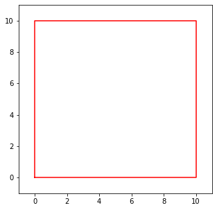

<h1 align = "center"> 2D变换</h1>


图像的2D变换就是图像的平移、旋转、放缩、仿射和投影等，其简要示意图如下：


<h2 align = "center">  一、原理 </h2>


### 1. 平移

2D平移同一个对象上的所有点的坐标都发生相同的偏移，其解析式可以写为:
$$
\begin{cases}
x' = x + \Delta x \\
y' = y + \Delta y \\
\end{cases}
$$
即所有点的横坐标都增加$\Delta x$，所有点的纵坐标都增加$\Delta y$。将解析式写成矩阵形式，如下：
$$
\boldsymbol{x} = 
\left[
	\begin{matrix}
   		1 & 0 & \Delta x \\
		0 & 1 & \Delta y 
	\end{matrix}
\right]
\left[
	\begin{matrix}
		x \\ 
		y \\
		1
	\end{matrix}
\right]
$$
 写成矩阵的好处是可以利用矩阵乘法进行2D变换，计算效率可以得到提升。


### 2. 旋转

2D平面上的每一个点都可以用极坐标的形式进行表示：
$$
\begin{cases}
x = rcos\alpha \\
y = rsin\alpha \\
\end{cases}
$$
以原点为圆心，将点$ (x, y) $旋转$\theta$角度后的坐标可表示为：
$$
\begin{aligned}
&(rcos(\alpha+\theta), rsin(\alpha+\theta)) \\
= &(rcos\alpha cos\theta - rsin\alpha sin\theta, rsin\alpha cos\theta + rcos\alpha sin\theta) \\
= &(xcos\theta - ysin\theta, xsin\theta + ycos\theta)
\end{aligned}
$$
使用矩阵形式表示**旋转+平移**如下：
$$
\boldsymbol{x} = 
\left[
	\begin{matrix}
   		cos\theta & -sin\theta & \Delta x \\
		sin\theta & cos\theta & \Delta y \\
	\end{matrix}
\right]
\left[
	\begin{matrix}
		x \\ 
		y \\
		1
	\end{matrix}
\right]
$$
矩阵的表示方法显得规范又美观！


### 3. 放缩

放缩即是对2D平面上的每一个点添加一个尺度变换因子，即：
$$
(x, y)→(sx, sy)
$$
同样的，使用矩阵形式将**放缩+旋转+平移**表示如下：
$$
\boldsymbol{x} = 
\left[
	\begin{matrix}
   		s\ cos\theta & -s\ sin\theta & \Delta x \\
		s\ sin\theta & s\ cos\theta & \Delta y \\
	\end{matrix}
\right]
\left[
	\begin{matrix}
		x \\ 
		y \\
		1
	\end{matrix}
\right] = 
\left[
	\begin{matrix}
   		a & -b & \Delta x \\
		b & a & \Delta y \\
	\end{matrix}
\right]
\left[
	\begin{matrix}
		x \\ 
		y \\
		1
	\end{matrix}
\right]
$$


### 4. 仿射

仿射变换指的是在向量空间中进行一次线性变换，变换到另一个向量空间的过程。即是：
$$
\begin{cases}
	x' = a_0x + b_0y + c_0 \\
	y' = a_1x + b_1y + c_1 \\
\end{cases}
$$

表示为矩阵形式即是：
$$
\boldsymbol{x} = 
\left[
	\begin{matrix}
   		a_0 & b_0 & c_0 \\
		a_1 & b_1 & c_1 \\
	\end{matrix}
\right]
\left[
	\begin{matrix}
		x \\ 
		y \\
		1
	\end{matrix}
\right]
$$
仿射变换依然保持着直线之间的平行性。


### 5. 投影

 投影也称作透视变换或同态映射，其作用在齐次坐标上：
$$
\boldsymbol{x}' = Hx = 
\left[
	\begin{matrix}
   		a_0 & b_0 & c_0 \\
		a_1 & b_1 & c_1 \\
		a_2 & b_2 & c_2
	\end{matrix}
\right]
\left[
	\begin{matrix}
		x \\ 
		y \\
		1
	\end{matrix}
\right]
$$
其中$H$是任意一个$3×3$的齐次矩阵，齐次意味着如果两个矩阵只在尺度上有差异，那这两个矩阵是等价的。齐次坐标$x'$必须进行规范化后才能获得非齐次的结果，即：
$$
x' = \frac{a_0x+b_0y+c_0}{a_2x+b_2y+c_2}, \ 
y' = \frac{a_1x+b_1y+c_1}{a_2x+b_2y+c_2}
$$
投影依然保持支线性，即直线变换后仍然是直线。


除了上述常见的2D变换外，还有拉伸、挤压、翻转等等变换，这里就不再详细介绍。下面就编写几个简单程序验证一下上述原理。


<h2 align = "center">  二、代码验证 </h2>

首先准备一个测试用例，并使用Python编写相应的绘图程序：

```python
import numpy as np
from matplotlib import pyplot as plt

# 绘图函数
def plot_rectangle(pts_arys, colors):
  plt.figure(num=1, figsize=(5, 5))
  minv, maxv = 100, 0
  for i, pts_ary in enumerate(pts_arys): 
    pts_ary = pts_ary[:2]
    pts_ary = np.hstack((pts_ary, pts_ary[:, 0].reshape((2, -1))))
    plt.plot(pts_ary[0], pts_ary[1], "-", color=colors[i])
    minv = min((minv, pts_ary.min()))
    maxv = max((maxv, pts_ary.max()))
  lim = (int(minv-1), int(maxv+1))
  plt.xlim(lim[0], lim[1])
  plt.ylim(lim[0], lim[1])
  plt.show()


# 原始的2D点
rect = np.array([
  [0, 10, 10, 0], 
  [0, 0, 10, 10], 
  [1, 1, 1, 1]
  ])

plot_rectangle((rect, ), ("r", ))
```




验证平移：

```python
# 平移
translate_factor = np.array([
  [1, 0, 5], 
  [0, 1, 5]
  ])
translated_rect = translate_factor.dot(rect)
plot_rectangle((rect, translated_rect), ("r", "g"))
```


验证旋转：

```python
# 旋转 + 平移
theta = 30 * np.pi / 180
cos_theta, sin_theta = np.cos(theta), np.sin(theta)
rotate_factor = np.array([
  [cos_theta, -sin_theta, 5], 
  [sin_theta, cos_theta, 5]
  ])
rotated_rect = rotate_factor.dot(rect)
plot_rectangle((rect, rotated_rect), ("r", "g"))
```


验证放缩：

```python
# 放缩+旋转+平移
scale_factor = np.array([
  [1.3, -0.8, 5], 
  [-0.8, 1.3, 5]
  ])
scaled_rect = scale_factor.dot(rect)
plot_rectangle((rect, scaled_rect), ("r", "g"))
```


验证仿射：

```python
# 仿射
affine_factor = np.array([
  [1.05, 0.95, 5], 
  [1.5, 0.5, 5]
  ])
affined_rect = affine_factor.dot(rect)
plot_rectangle((rect, affined_rect), ("r", "g"))
```


 

验证投影：

```python
# 投影
project_factor = np.array([
  [1.05, 0.95, 2], 
  [1.5, 0.5, 3], 
  [0.99, 0.1, 0.5]
  ])
projected_rect = project_factor.dot(rect)
projected_rect[0] /= projected_rect[2]
projected_rect[1] /= projected_rect[2]
plot_rectangle((rect, projected_rect), ("r", "g"))
```


<h2 align = "center">  三、应用于图像 </h2>

从零编写2D变换的程序太耗费精力，且不一定具有实用性和适用性，这里就直接介绍一些C++调用opencv接口实现的用例。直接上代码罢！

```C++
#include <opencv2/highgui.hpp>
#include <opencv2/imgproc.hpp>

void affine(cv::Mat& src, cv::Mat& dst, const cv::Point2f* src_pts, const cv::Point2f* dst_pts)
{
    // Get affine translate matrix by 3 points, and then apply affine transformation
	cv::Mat translator = cv::getAffineTransform(src_pts, dst_pts);
	cv::warpAffine(src, dst, translator, src.size(), cv::INTER_LINEAR, cv::BORDER_CONSTANT, cv::Scalar());
}

void project(cv::Mat& src, cv::Mat& dst, const cv::Point2f* src_pts, const cv::Point2f* dst_pts)
{
    // Get project translate matrix by 4 points, and then apply project transformation
	cv::Mat translator = cv::getPerspectiveTransform(src_pts, dst_pts);
	cv::warpPerspective(src, dst, translator, src.size(), cv::INTER_LINEAR, cv::BORDER_CONSTANT, cv::Scalar());
}

void twoDTransTest()
{
    // Original image: left top
	std::string im_path = ".../lazySheep.jpg";
	cv::Mat im = cv::imread(im_path);
	cv::Point2f src_pts[3] = { {0, 0}, {500, 0}, {500, 500} };
	cv::Point2f dst_pts[3] = { {0, 0}, {500, 0}, {500, 500} };
	cv::Mat translated_im = cv::Mat::zeros(im.rows * 2, im.cols * 3, CV_8UC3);
	im.copyTo(translated_im.rowRange(0, im.rows).colRange(0, im.cols));

	// Translate: middle, top
	cv::Mat temp;
	dst_pts[0] = { 100, 100 };
	dst_pts[1] = { 600, 100 };
	dst_pts[2] = { 600, 600 };
	affine(im, temp, src_pts, dst_pts);
	temp.copyTo(translated_im.rowRange(0, im.rows).colRange(im.cols, 2 * im.cols));

	// Rotation: right, top
	dst_pts[0] = { 1000, 0 };
	dst_pts[1] = { 1000, 500 };
	dst_pts[2] = { 500, 500 };
	affine(im, temp, src_pts, dst_pts);
	temp.copyTo(translated_im.rowRange(0, im.rows).colRange(2 * im.cols, 3 * im.cols));

	// Scale: left, bottom
	dst_pts[0] = { 0, 0 };
	dst_pts[1] = { 250, 0 };
	dst_pts[2] = { 250, 250 };
	affine(im, temp, src_pts, dst_pts);
	temp.copyTo(translated_im.rowRange(im.rows, 2 * im.rows).colRange(0, im.cols));

	// Affine: middle, bottom
	dst_pts[0] = { 250, 100 };
	dst_pts[1] = { 500, 0 };
	dst_pts[2] = { 750, 400 };
	affine(im, temp, src_pts, dst_pts);
	temp.copyTo(translated_im.rowRange(im.rows, 2 * im.rows).colRange(im.cols, 2 * im.cols));

	// Project: right, bottom
	cv::Point2f src_pjt[4] = { {0, 0}, {500, 0}, {500, 500}, {0, 500} };
	cv::Point2f dst_pjt[4] = { {100, 200}, {400, 100}, {400, 400}, {100, 400} };
	project(im, temp, src_pjt, dst_pjt);
	temp.copyTo(translated_im.rowRange(im.rows, 2 * im.rows).colRange(2 * im.cols, 3 * im.cols));

	cv::imwrite(".../lazySheeps.png", translated_im);
}
```

结果如下：


最后说点儿什么呢？总结2D变换时，脑子里一直在想PPT的各种翻页跳转动画，有点儿冲动的想去尝试实现一下，但是写着写着就不冲动了，因为太难啦又很难看到有什么用，哈哈，还是就这样吧！


