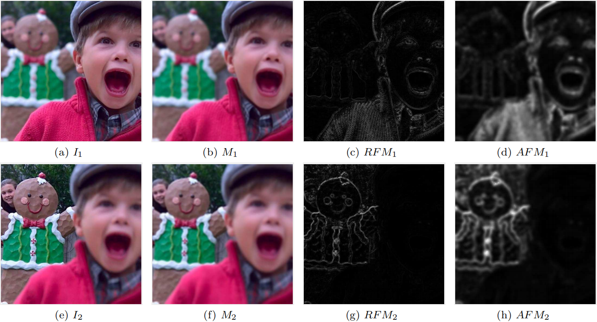
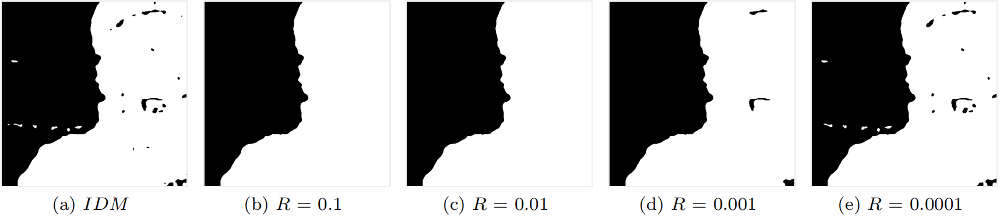
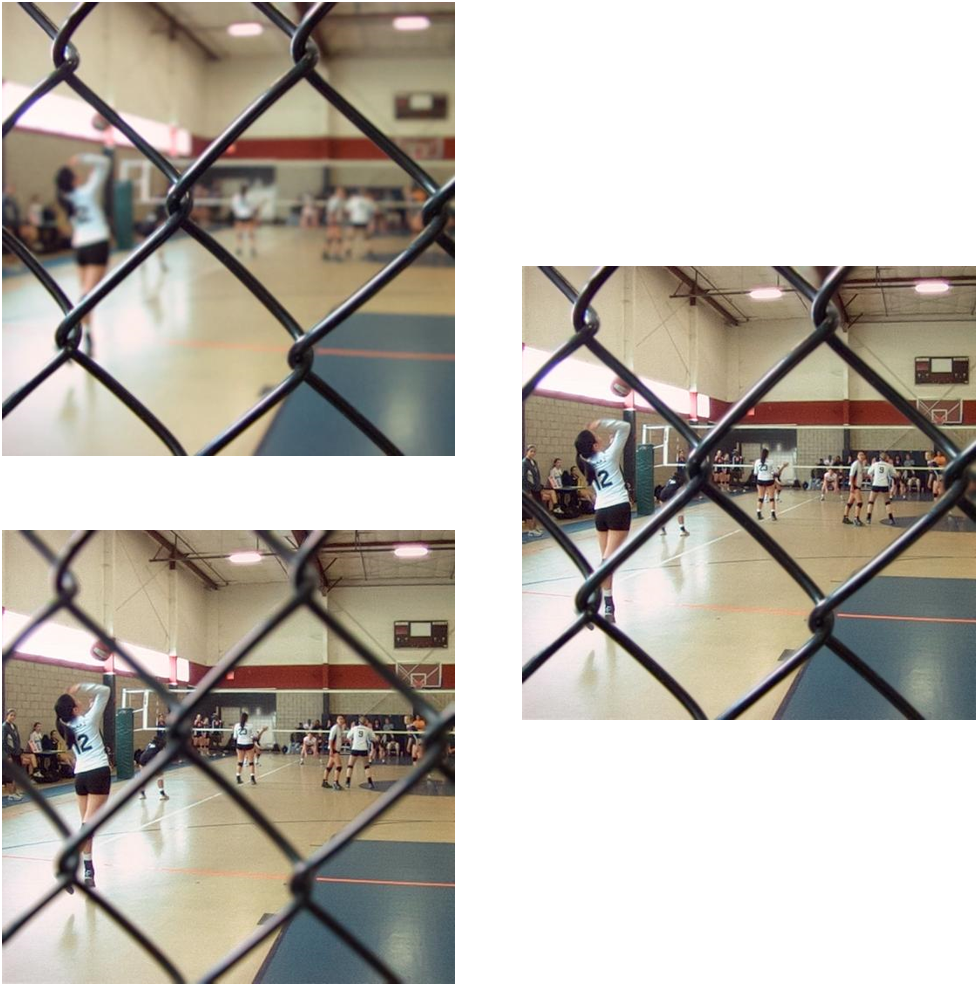
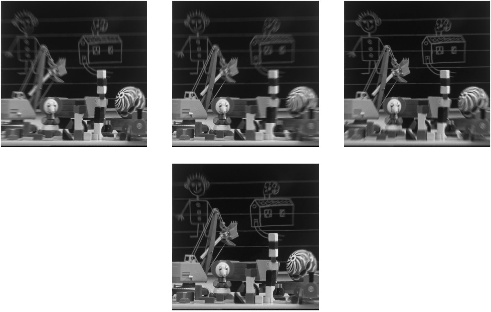

# GFDF 基于导向滤波检测聚焦区域的多焦图像融合

## 前言

因为工作关系，最近看了很多图像融合算法，其中一篇2019年的论文：Guided filter-based multi-focus image fusion through focus region detection提出的针对多焦图像的融合算法GFDF，实验效果很不错。因此想要简单介绍其原理并尝试复现一下。


## 原理概述

这篇论文提出的算法大致可分为三步：

- 聚焦区域检测（Focus region detection），从每张单层图像中检测出聚焦区域；
- 决策图生成（Decision map generation），决定融合图中的每个像素主要来自哪一张单层图像；
- 融合（Fusion），将多张单层图像融合为一张。

下面对每步进行更详细的介绍。


### 聚焦区域检测

聚焦区域检测也可细分为三步：

首先，对每张单层图像分别使用均值滤波进行平滑，即：
$$
M_i(x,y)=I_i(x,y)*fm
$$
其中，$I_i(x,y)$是未平滑的原图，$fm$是均值滤波器，$M_i(x,y)$是均值滤波后的平滑图，而$i\in[1,n]$是每张单层图像的序号，$n$是单层图像的数量。

然后，使用原图和平滑图相减获取粗略的聚焦图，即：
$$
RFM_i(x,y)=|I_i(x,y)-M_i(x,y)|
$$
通过这两步可以预见，原图中的模糊区域，平滑后仍是模糊的，相减之后差别不会太大，而原图中聚焦的清晰区域，平滑后变得模糊了，相减之后差别会相对较大。这样，就可以区分原图中的聚焦区域和模糊区域。

最后，对粗略的聚焦图进行导向滤波。即：
$$
AFM_i(x,y)=GF_{r,\epsilon}(I_i(x,y), RFM_i(x,y))
$$
这一步的目的其实是将原图作为导向图，通过导向滤波器向粗略的聚焦图中添加更多的高频信息，从而优化高频部分的融合效果。

每步处理后的效果如下图所示，可以看到每张单层图像中检测得到的聚焦区域均大致分布在清晰区域，聚焦效果十分nice！




### 决策图生成

由于聚焦越好的像素在聚焦图中的值越大，而越失焦相对越小，因此可以通过比较聚焦图中每个像素值大小的方式决定融合图中的像素主要来自于哪一张单层图，用解析式表示即是：
$$
IDM_i(x,y)=\left\{
\begin{aligned}
&1,\ max|AFM_i(x,y),\ i\in[1,n]| = AFM_i(x,y) \\
&0,\ otherwise
\end{aligned}
\right.
$$
其中$IDM_i(x,y)$是第$i$张单层图像在像素点$(x,y)$处的初始决策，当$AFM_i(x,y)$取值为所有聚焦图中最大时，其值为$1$，反之则为$0$。

虽然提出的聚焦区域检测方法十分有效，但仍会存在一些失焦区域被检测为聚焦区域。通常这样的区域被环绕在聚焦区域之内，且面积较小。因此，文章使用面积阈值对小面积的聚焦区域进行滤除，尽量滤除局部误识别区域。如下图所示，作者基于图像面积设置不同比例进行滤除：



但这里我觉得存在两个问题：

* 只有两张单层图像时，可以将一张图中滤除的小聚焦区域转移到另一张图中。那么三张及更多单层图像时呢？滤除的小聚焦区域该转移到哪张单层图像？
* 如果多张聚焦图在某一点均取得最大值，此点该如何决策？

根据每个像素点处的决策，可以合成一张初步融合图：
$$
I_{IF}(x,y)=I_i(x,y),\ if\ IDM_i(x,y)=1
$$
这样的融合图，在决策边缘肯定会出现很明显的痕迹。文章中将初步融合图作为导向图，使用导向滤波对每张单层图像的决策图进行处理，得到最终的决策图：
$$
FDM_i(x,y)=GF_{r,\epsilon}(I_{IF}(x,y),IDM_i(x,y))
$$
由于导向滤波的特性，决策边界处会被稍许平滑但也能保持其良好的边缘，而远离决策边界的区域即是被平滑，仍能维持原来的决策。


### 融合

融合的方式其实就是根据决策图，对每张单层图下像进行加权：
$$
I_F(x,y)=\frac{\sum_{i=[1,n]}FDM_i(x,y)I_i(x,y)}{\sum_{i=[1,n]}FDM_i(x,y)}
$$


## 代码实现

下面使用C++结合Opencv实现对多张BGR三通道的图像进行融合算法，既可以融合两张单层图像，也可融合两张以上的单层图像。另外，这里我将过滤掉的小面积区域分配到离各自最近的确定区域，实际应用中可根据需要采用其他策略。代码如下：

```C++
/*
Parameters of GFDF
*/
struct GfdfParam
{
	double ar = 0.01;	// Area smaller than (ar * image size) will be removed
	int msz = 7;	// Mean filter size
	int gsz = 5;	// Guided filter size
	float eps = 0.3f;	// Guided filter regularization
};

/*
Focus region detection.
@param src: Source single-channel image
@param dst: Detected focus region
@param msz: Kernel size for mean filter
@param gsz: Kernel size for guided filter
@param eps: Regularization parameter
*/
void frd(cv::Mat& src, cv::Mat& dst, const int msz, const int gsz, const float eps)
{
	cv::Mat src_blur, src_diff;
	cv::blur(src, src_blur, { msz, msz });
	cv::absdiff(src, src_blur, src_diff);
	guidedFilter(src, src_diff, dst, gsz, eps);
}

/*
Filter small regions and return them.
@param src: Mask with many regions
@param dst: Mask without small regions
@param area_thresh: Min area allowed
@return: Regions be filtered
*/
cv::Mat filterSmallRegions(cv::Mat& src, cv::Mat& dst, const double area_thresh)
{
	std::vector<std::vector<cv::Point>> contours;
	cv::findContours(src, contours, cv::RETR_EXTERNAL, cv::CHAIN_APPROX_NONE);

	std::vector<std::vector<cv::Point>> filtered_contours;
	for (int i = 0; i < contours.size(); i++)
	{
		const double area = cv::moments(contours[i]).m00;
		if (area < area_thresh)
			filtered_contours.push_back(contours[i]);
	}

	cv::Mat filtered_mask = cv::Mat::zeros(src.size(), CV_8UC1);
	cv::fillPoly(filtered_mask, filtered_contours, 255);
	
	src.copyTo(dst);
	dst.setTo(0, filtered_mask);
	return filtered_mask;
}

/*
GFDF for bgr-channels image.
@param srcs: The pointer of source images
@param dst: Fused image
@param num: Number of source images
@param GP: GFDF parameters
*/
void gfdf3(cv::Mat* srcs, cv::Mat& dst, const int num, GfdfParam& GP)
{
	const double factor = 1.0 / 255;
	const int h = srcs[0].rows;
	const int w = srcs[0].cols;
	const double min_area = GP.ar * h * w;

	cv::Mat* _srcs = new cv::Mat[num];
	cv::Mat* _grays = new cv::Mat[num];
	cv::Mat* afms = new cv::Mat[num];
	cv::Mat maxfm = cv::Mat::zeros(h, w, CV_32FC1);
	cv::Mat idm = cv::Mat::zeros(h, w, CV_32SC1);
	for (int i = 0; i < num; i++)
	{
		// Preprocessing
		srcs[i].convertTo(_srcs[i], CV_32FC1, factor);
		cv::cvtColor(_srcs[i], _grays[i], cv::COLOR_BGR2GRAY);

		// Focus region detection
		frd(_grays[i], afms[i], GP.msz, GP.gsz, GP.eps);

		// Initial decision <-----> Maximum
		cv::Mat larger_mask;
		cv::compare(afms[i], maxfm, larger_mask, cv::CMP_GT);
		afms[i].copyTo(maxfm, larger_mask);
		idm.setTo(i, larger_mask);
	}

	// Filter small decision regions
	cv::Mat* idms = new cv::Mat[num];
	cv::Mat undecided_mask = cv::Mat::zeros(h, w, CV_8UC1);
	for (int i = 0; i < num; i++)
	{
		cv::compare(idm, i, idms[i], cv::CMP_EQ);
		cv::Mat one_undecide = filterSmallRegions(idms[i], idms[i], min_area);
		undecided_mask.setTo(255, one_undecide);
	}

	// Decide undecided regions by nearest decided region
	cv::Mat min_dist(h, w, CV_32FC1, cv::Scalar::all(h));
	for (int i = 0; i < num; i++)
	{
		cv::Mat inv_mask, dist, smaller_mask;
		cv::subtract(255, idms[i], inv_mask);
		cv::distanceTransform(inv_mask, dist, cv::DIST_L1, 3, CV_32FC1);
		
		cv::compare(dist, min_dist, smaller_mask, cv::CMP_LT);
		dist.copyTo(min_dist, smaller_mask);
		cv::bitwise_and(smaller_mask, undecided_mask, smaller_mask);
		idm.setTo(i, smaller_mask);
	}

	// Finally decide and Directly fusion
	cv::Mat imdfu(h, w, CV_32FC1);
	for (int i = 0; i < num; i++)
	{
		cv::compare(idm, i, idms[i], cv::CMP_EQ);
		_grays[i].copyTo(imdfu, idms[i]);
	}

	// Get fusion decision map
	cv::Mat* fdms = new cv::Mat[num];
	cv::Mat sum_fdms = cv::Mat::zeros(h, w, CV_32FC1);
	for (int i = 0; i < num; i++)
	{
		guidedFilter(imdfu, idms[i], fdms[i], GP.gsz, GP.eps);
		cv::add(fdms[i], sum_fdms, sum_fdms);
	}

	// Funsion
	cv::Mat imfu = cv::Mat::zeros(h, w, CV_32FC3);
	for (int i = 0; i < num; i++)
	{
		cv::divide(fdms[i], sum_fdms, fdms[i]);
		cv::Mat m3[3] = { fdms[i], fdms[i], fdms[i] };
		cv::merge(m3, 3, fdms[i]);

		cv::add(imfu, _srcs[i].mul(fdms[i]), imfu);
	}
	imfu.convertTo(dst, CV_8UC1, 255);

	delete[] _srcs;
	delete[] _grays;
	delete[] afms; 
	delete[] idms; 
	delete[] fdms;
}
```

关于导向滤波的实现函数此处并未展示，详细实现可参考我的另一篇博文：[导向滤波](https://zhuanlan.zhihu.com/p/386520985)。


## 效果

对两张单层图像的融合：




对三张图像的融合：




可以看到对两张及以上的图像都有较好的融合效果。当然，文章还提及了很多融合效果的评价方法，感兴趣的可以进一步了解，此处不再赘述。


